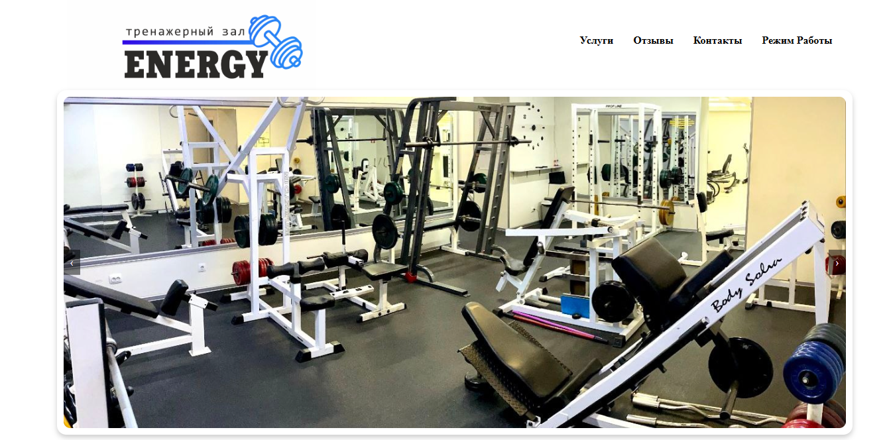

# Energy Gym Landing Page

Welcome to the GitHub repository for the **Energy Gym Landing Page**. This project is a sleek and modern landing page designed for a fitness gym called "Energy." The website aims to attract potential clients by showcasing the gym's features, classes, trainers, and membership options.

## 📋 Table of Contents

- [Features](#features)
- [Screenshots](#screenshots)
- [Demo](#demo)
- [Installation](#installation)
- [Usage](#usage)
- [Technologies Used](#technologies-used)
- [Contributing](#contributing)
- [License](#license)
- [Contact](#contact)

## ✨ Features

- **Responsive Design**: Works on all devices (desktop, tablet, mobile).
- **Modern UI/UX**: Sleek and user-friendly interface.
- **Dynamic Content**: Information on trainers, classes, and membership plans.
- **Contact Form**: Allows users to easily get in touch.

## 📸 Screenshot



## 🚀 Demo

Check out the live demo [here]().

## ⚙️ Installation

To set up the project locally, follow these steps:

1. **Clone the repository**:

    ```bash
    git clone https://github.com/yourusername/energy-gym-landing-page.git
    ```

2. **Navigate to the project directory**:

    ```bash
    cd energy-gym-landing-page
    ```

3. **Install dependencies** (if any, adjust according to the project):

    ```bash
    npm install
    ```

4. **Run the project**:

    ```bash
    npm start
    ```

## 🛠️ Usage

- Open the `index.html` file in your browser to view the landing page.
- Customize the content in the HTML, CSS, and JS files to suit your needs.

## 🧰 Technologies Used

- **HTML5**
- **CSS3**
- **JavaScript**
- **FontAwesome** (for icons)
- **AOS** (Animate On Scroll Library for animations)

## 🤝 Contributing

Contributions, issues, and feature requests are welcome!

1. Fork the repository.
2. Create your feature branch: `git checkout -b feature/YourFeature`
3. Commit your changes: `git commit -m 'Add some feature'`
4. Push to the branch: `git push origin feature/YourFeature`
5. Open a pull request.

## 📜 License

This project is licensed under the MIT License - see the [LICENSE](LICENSE) file for details.

## 📧 Contact

For any inquiries, please contact:

- **Your Name** - [korablyow.ivan@gmail.com](mailto:korablyow.ivan@gmail.com)
- [GitHub Profile](https://github.com/ivankorabl)
